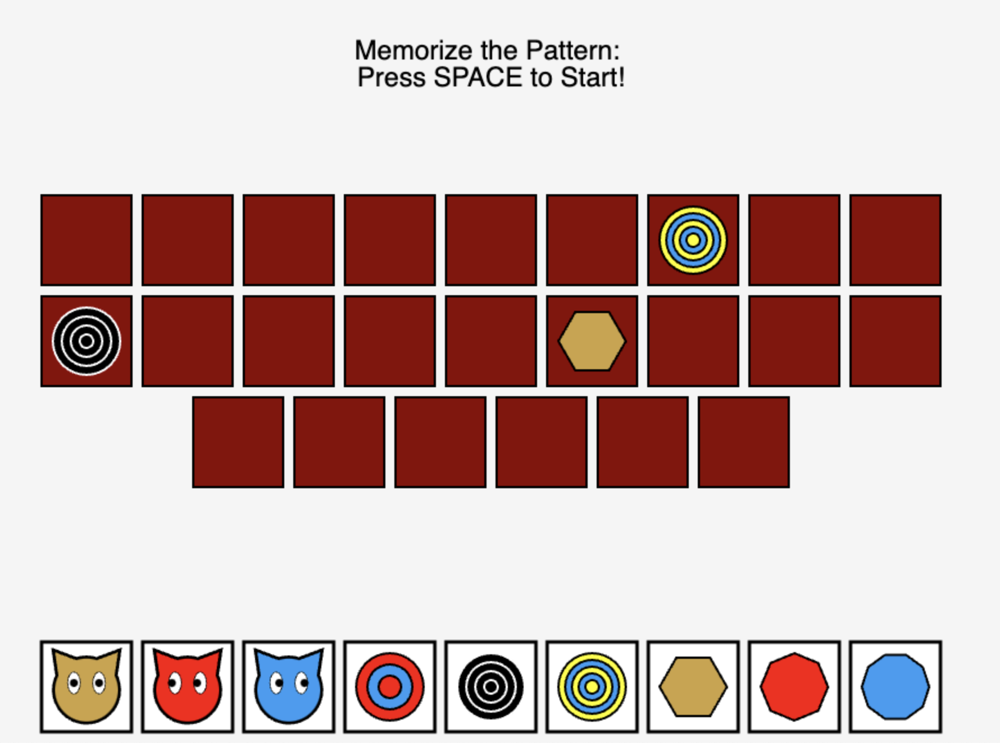

# Does-it-Match?



**Does It Match?** is an engaging pattern memory game where players must identify and match animated shapes. Built with animations, this game challenges players' observation and memory skills.

## 🎮 Gameplay

1. **Memorize the Pattern**: A set of shapes will briefly appear in a specific sequence or position.  
3. **Match the Shapes**: Select the correct shapes in the same order from a set of options.  

## ✨ Features

- **Interactive UI**: Simple drag-and-drop or click-based interactions for easy gameplay.  
- **Difficulty Levels**: Choose from multiple difficulty settings to match your skill level.  

## 🛠️ Built With

- **Simulation-Based Animations**: Spinning and wiggling mechanics create dynamic challenges.  
- **Intuitive Game Design**: User-friendly interface for players of all ages.

## 🚀 Getting Started

### Installation

```bash
# Clone the repository
git clone https://github.com/jennymyzhang/does-it-match-.git
cd game

# Run the game
npm run dev
